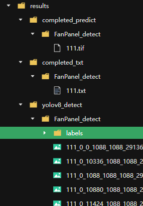

# DOFP — 基于yolov8的风机与光伏板检测项目

## 环境配置

### 基础环境
```bash
# 创建conda虚拟环境
conda create -n DOFP python=3.9 -y
conda activate DOFP
# 安装依赖
pip install ultralytics rasterio
```

### gdal库配置
**注**：优先使用第一种conda方法安装；如果等待时间过长，使用pip方法安装（本地whl包已包含在项目根目录下）。

1. 使用conda方法
```bash
conda install -c conda-forge gdal -v
```
2. 使用pip方法
```bash
pip install ./GDAL-3.4.1-cp39-cp39-manylinux_2_5_x86_64.manylinux1_x86_64.whl
```
3. whl包下载地址（如果该whl包与本地配置冲突，请自行下载对应版本的whl包）
- [linux系统](https://sourceforge.net/projects/gdal-wheels-for-linux/files/)
- [windows系统](https://github.com/cgohlke/geospatial-wheels)


## Usage

### 注意
可以直接将图片放在项目根目录下的`images`文件夹中。

### 命令行
本项目支持命令行参数，可通过设置命令行参数进行模型推理，请在`predict.py`下运行，相关命令行参数如下：

```shell
[--images_dir IMAGES_DIR] # 所存放照片的文件夹路径， 默认为：FanPanel_detect/images
[--outdir_slice_ims OUTDIR_SLICE_IMS] # 图像分割结果路径，无需设置，会自动生成，默认为：FanPanel_detect/dataset/predict/slice_images/Fan
[--project_name PROJECT_NAME]
# 一次推理任务的项目名称，推理结果的ID,不同任务请不用重复，否则会覆盖结果。
# yolov8原始模型预测结果路径：./results/yolov8_detect/项目名称， 自动生成，无需修改
[--im_ext IM_EXT] # 推理文件的后缀名称，如.tif
[--sliceHeight SLICEHEIGHT] # 图像裁剪高度， 默认1088， 根据具体情况更改
[--sliceWidth SLICEWIDTH] # 图像裁剪宽度. 默认1088
[--overlap OVERLAP] # 图像裁剪重复率，默认0.5，太小会出现无法捕获大型目标的完整检测框
[--slice_sep SLICE_SEP] # 分割结果名称的分隔符号，默认'_'
[--overwrite OVERWRITE]  # 图像裁剪结果已存在时是否重写， 默认Flase
[--out_ext OUT_EXT] # 裁剪结果的后缀名称，默认.png
[--model MODEL] # 模型训练结果文件
[--conf CONF] # 检测对象置信度阈值
[--iou IOU] # NMS的交集联合（IoU）阈值
[--half HALF] # 是否使用半精度（FP16）
[--device DEVICE] # 要运行的设备，即cuda设备=0/1/2/3或设备=cpu
[--show SHOW] # 如果可能，显示结果
[--save SAVE] # 保存带有结果的图像
[--save_txt SAVE_TXT] # 将结果保存为. txt文件
[--save_conf SAVE_CONF] # 使用置信度分数保存结果
[--save_crop SAVE_CROP] # 保存带有结果的裁剪图像
[--hide_labels HIDE_LABELS] # 是否隐藏标签
[--hide_conf HIDE_CONF] # 是否隐藏置信度
[--max_det MAX_DET] # 每张图像的最大检测次数
[--vid_stride VID_STRIDE] # 视频帧率步幅
[--line_width LINE_WIDTH] # 边界框的线宽。如果无，则按图像大小缩放。
[--visualize VISUALIZE] # 可视化模型特征
[--augment AUGMENT] # 将图像增强应用于预测源
[--agnostic_nms AGNOSTIC_NMS] # 与类无关的NMS
[--retina_masks RETINA_MASKS] # 使用高分辨率分割掩码
[--classes CLASSES [CLASSES ...]] # 按类过滤结果，即class=0，或class=[0,2,3]
[--boxes BOXES] # 在分割预测中显示框
[--output_file_dir OUTPUT_FILE_DIR] #  模型预测最后txt结果文件的路径，无需修改，默认为：yoltv8\results\completed_txt\项目名称， txt结果会自动成在此路径下
[--iou_threshold IOU_THRESHOLD] # 回归大图时进行perclassnms的iou阈值，默认为0.01，即，默认同类物体其检测框不应该出现重叠，符合当前任务需求，可根据实际情况修改
[--confidence_threshold CONFIDENCE_THRESHOLD] # 回归大图时进行perclassnms的置信度阈值，默认为0.5
[--area_weight AREA_WEIGHT] # 回归大图时进行perclassnms的置信度与面积的比例权重，默认为5
[--class_labels CLASS_LABELS [CLASS_LABELS ...]] # 类别的标签结果，默认[0, 1, 2, 3, 4, 5]
[--class_names CLASS_NAMES [CLASS_NAMES ...]] # 类别标签对应的名称，默认怕["head", "boxholder", "greendevice", "baseholer", "circledevice", "alldrop"]
[--completed_output_path COMPLETED_OUTPUT_PATH] # 模型预测最后txt结果文件的路径，无需修改，默认为：yoltv8\results\completed_predict\项目名称， 图像结果会自动成在此路径下
```

本次任务一般仅需要修改以下参数（其他参数可保持默认，请根据实际情况进行设置）：

1. `images_dir`参数，指定你所存放照片的文件夹路径（注意照片路径，而是存在照片的上级文件夹路径，路径及照片名称中不可出现中文汉字），

   如：--image_dir ./images, 可将推理照片存放在默认`images`路径下。

2. `im_ext`参数，你所需要进行推理的照片格式，如.jpg、.png等（无需区分大小写，但要注意不要遗忘了    **.**    ）。推理时，只会对images_dir下的以im_ext为后缀名的文件进行推理。

3. `model`参数，指定模型结果文件的路径，如 --model ./yoloFan.pt，除pt文件外，也支持onnx文件、engine文件等yolov8等官方支持的模型结果文件格式。

命令行启动示例：

```
   python predict.py --images_dir ./images --im_ext .tif --model ./yoloFan.pt
```

本项目还可直接修改`predict.py`文件中的命令函参数设置部分，这样就无需再命令行中进行修改,，修改参数信息后直接启动predict.py即可。各参数信息和前文一样。

结果路径示例展示（FanPanel_detect为本次推理的项目名称）：
