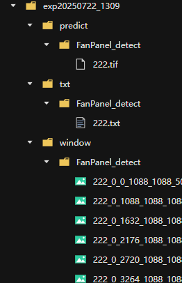

# DOFP — 基于 yolov8 的风机与光伏板检测项目

---

## 环境配置

### 基础环境
```bash
# 创建 conda 虚拟环境
conda create -n DOFP python=3.9 -y
conda activate DOFP
# 安装依赖
pip install ultralytics rasterio
```

### gdal库配置
**注**：优先使用第一种 conda 方法安装；如果等待时间过长，使用 pip 方法安装（本地 whl 包已包含在项目根目录下）。

1. 使用conda方法
```bash
conda install -c conda-forge gdal -v
```
2. 使用pip方法
```bash
pip install ./GDAL-3.4.1-cp39-cp39-manylinux_2_5_x86_64.manylinux1_x86_64.whl
```
3. whl 包下载地址（如果该 whl 包与本地配置冲突，请自行下载对应版本的 whl 包）
- [linux系统](https://sourceforge.net/projects/gdal-wheels-for-linux/files/)
- [windows系统](https://github.com/cgohlke/geospatial-wheels)

---

## 注意事项
- 建议直接将图片放在项目根目录下的`images`文件夹中，就无需修改路径参数。
- 可直接修改`predict.py`文件中的命令参数设置部分，这样就无需再命令行中进行修改，修改参数信息后直接启动`predict.py`即可。

---

## 参数设置
本项目支持命令行参数，可通过设置命令行参数进行模型推理，请在`predict.py`下运行，相关命令行参数如下：

本次任务一般仅需要修改以下参数（其他参数可保持默认，请根据实际情况进行设置）：

- `images_dir`参数：指定存放待识别图片的文件夹路径（路径及图片名称中不可出现中文汉字）。

   *如：--image_dir ./images, 则路径被指定为根目录下的`images`文件夹。*

- `im_ext`参数：需要检测的照片格式。

   *如：--im_ext .tif, 则输入格式被指定为 tif。*

- `model`参数：指定检测用到的模型。

   *如：--model ./yoloFan.pt, 则模型被指定为根目录下的 yoloFan.pt。*

---

## 命令行启动示例：

```bash
python predict.py --images_dir ./images --im_ext .tif --model ./yoloFan.pt
```

---

## 输出结果示例：

说明：